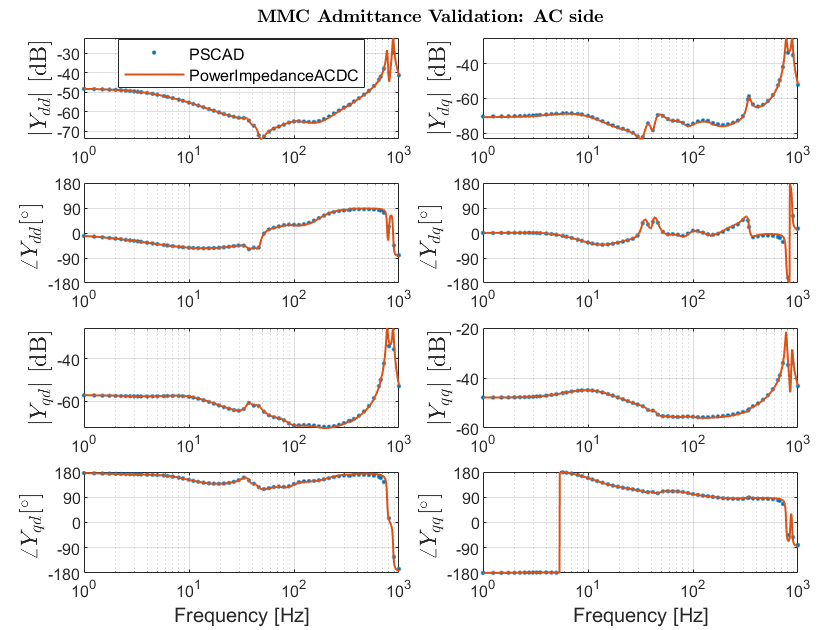

# PowerImpedanceACDC
PowerImpedanceACDC is a Julia-based implementation for the frequency-domain analysis of modern power systems.
Its core functionalities include impedance/admittance characterization and small-signal stability assessment.
The analysis relies on analytical models validated against the Electromagnetic Transient (EMT) simulation software PSCAD.
The implemented components are:
- Modular Multilevel Converter (MMC) with various controls (Grid-Following and Grid-Forming)
- Two-level converter with various controls
- Overhead lines and underground cables
- Synchronous generator
- Transformers
- Impedances
- Ideal voltage sources

Following features are currently implemented:
- Impedance/admittance identification
- Stability assessment via the Generalized Nyquist Criterion (GNC), applicable to standalone-stable Multiple-Input Multiple-Output (MIMO) systems
- Oscillation mode identification via Eigenvalue Decomposition (EVD) and bus participation factors
- Passivity assessment and Singular Value Decomposition (SVD) functions 

The following figure shows the admittances of an High Voltage Direct Current (HVDC) link with two MMCs, validated against PSCAD. You can find this example, along with explanations, in the `example` folder.



## Installation
The latest stable release of PowerImpedanceACDC can be installed using the Julia package manager with
```julia
] add PowerImpedanceACDC
```

## Citation
If you find PowerImpedanceACDC useful in your work, we kindly request that you cite the following:
```
@misc{PowerImpedanceACDC2025,
  author       = "Electa",
  title        = "PowerImpedanceACDC. Impedance-based stability analyses.",
  month        = "March",
  year         = "2025",
}
```

## Contributors
- Aleksandra Lekic & Özgür Can Sakinci: main developers
- F. Garcia, J. Kircheis, A. Saad, R. Vander Eeckt: additional functionalities and validation

## License
This is a free software: you can redistribute it and/or modify it under the terms of the GNU General Public License as published by the Free Software Foundation, either version 3 of the License, or (at your option) any later version. PowerImpedanceACDC is distributed in the hope that it will be useful, but without any warranty; without even the implied warranty of merchantability or fitness for a particular purpose. See the GNU General Public License for more details.

## Future work
- $V_{ac}$-droop for two-level converter
- $V_{ac}$-control for both converters
