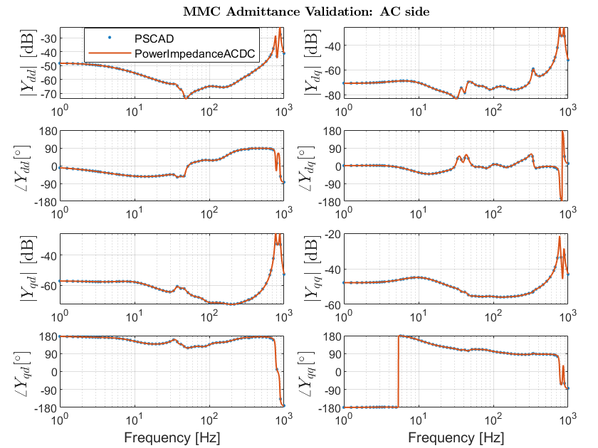

# PowerImpedanceACDC
PowerImpedanceACDC is a Julia-based implementation for the frequendy-domain analysis of modern power systems.
The core functionalities are admittance characterization and small-signal stability assessment.
The analysis relies on analytical models validated against the EMT simulation software PSCAD.
The implemented components are:
- Modular Multilevel Converter with various controls (Grid-Following and Grid-Forming)
- Two-level converter with various controls
- Oherhead lines and underground cables
- Transformers
- Impedance
- AC-source

Following features are currently implemented:
- Impedance/admittance identifaction
- Stability assessment via Generalized Nyquist Criteria applicable to standalone-stable MIMO systems
- Oscillation mode identification via eigenvalue decomposition (EVD) and bus participation factors
- Passivity assessment and Singular Value Decomposition functions 

Following figure, shows the admittances of an HVDC link with 2 MMC's, validated against PSCAD. In the example folder you can find the example together with some explanations.

## Installation
The latest stable release of PowerModels can be installed using the Julia package manager with
```julia
] add PowerModelsACDC
```

## Citation
If you find PowerImpedanceACDC useful in your work, we kindly request that you cite the following:
```
@misc{PowerImpedanceACDC2025,
  author       = "Electa",
  title        = "PowerImpedanceACDC. Impedance-based stability analyses.",
  month        = "March",
  year         = "2025",
}
```

## Contributors
- Aleksandra Lekic & Özgür Can Sakinci: main developers
- F. Garcia, J. Kircheis, A. Saad, R. Vander Eeckt: additional functionalities and validation

## License
This is a free software: you can redistribute it and/or modify it under the terms of the GNU General Public License as published by the Free Software Foundation, either version 3 of the License, or (at your option) any later version. PowerImpedanceACDC is distributed in the hope that it will be useful, but without any warranty; without even the implied warranty of merchantability or fitness for a particular purpose. See the GNU General Public License for more details.

## Future work
- $V_{ac}$-droop for two-level converter
- $V_{ac}$-control for both converters
- Synchronous machines