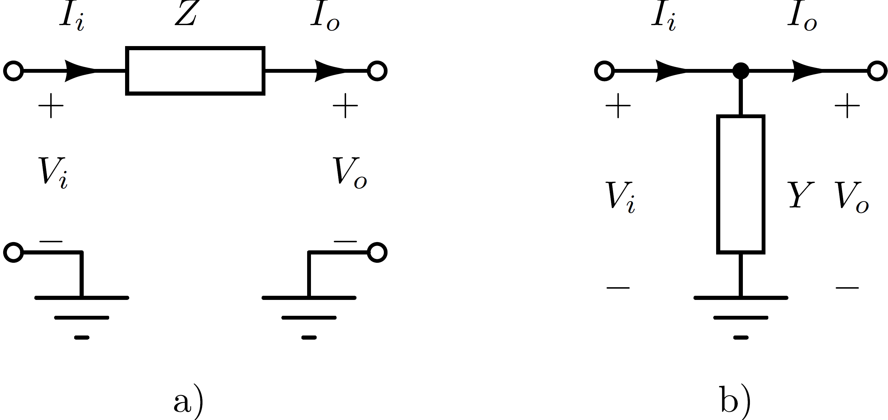

# Introduction
At present, new power electronics-based active components are being introduced in the power system at an astonishing rate. When considering High Voltage Direct Current (HVDC) systems, the most important circuit topology is the voltage source converters (VSC), and more in particular Modular Multilevel Converters (MMCs), a.o. because of its lower losses compared to traditional 2-level topologies. The MMC is characterised by its fast operation and control possibilities [^1]. The integration of these devices are bringing new requirements for the system operation and the stability when considering their interactions, e.g. with each other or with the surrounding passive network components. In general, it has to be ensured that the power system operates in a stable way with the desired performance under the desired operation conditions, and that it can be stabilised in the case of the disturbances [^2]. The active nature of the components makes that significant research and development efforts have historically been related to the protection and the controller design, in particular when considering multi-terminal HVDC-based systems [^3] [^4].

Compared to traditional AC system stability, converter controllers interact with the surrounding power system, and hence also with one another, over an extended frequency region when considering small-signal stability. The resulting negative interactions have been referred to in recent years as 'harmonic stability' or 'electromagnetic stability'
[^5]. Harmonic stability assessment can be undertaken in the Laplace-domain or frequency-domain using either a state-space representation or an impedance-based (admittance-based) analysis [^6]. Basic electromagnetic transient (EMT) time domain simulation tools, such as PSCAD and EMTP-RV, on the contrary give rise to long simulation times by checking the stability of each operating condition, which renders it less suitable for a fast system performance check. Motivated by the work initially introduced by Middlebrook [^7], related to input filter design, the so-called impedance-based stability assessment has been further investigated and implemented for the purpose of the power system stability analysis.
Impedance-based system stability is a promising approach still gaining popularity especially for VSC HVDC systems, possibly connected in a multi-terminal configuration [^8] [^9]  [^10] [^5] [^11].

In order to capture the influence of every passive and active component in the power system over an wide frequency range, it is necessary to model components with as much mathematical details as possible, including their frequency-dependent behaviour (e.g. lines, cables), as well as the impact of converter controls (e.g. MMCs). EMT tools such as PSCAD do offer frequency scanning routines for the passive network components (e.g. lines and cables). However, since traditional harmonic studies are concerned with the steady-state harmonic amplification through the network, rather than with the small-signal stability, thesebuilt-in scanning routines do not allow for including a small-signal representation of the converter and its control [^5].
Therefore, in the framework of the Neptune project, the decision was made to start the development of a software tool dedicated towards the small-signal stability screening using an impedance-based approach in the frequency domain, including both active and passive network components. In order to obtain the interactions using highly detailed component descriptions, a new mathematical methodology for the modelling of the network using ABCD parameters is proposed and developed. The next sections describe the development of the methodology.

## Multiport ABCD representation
Classical circuit theory applied to power systems relies on the description of the system using admittance matrices or hybrid matrices [^2] [^12]. Commonly, the circuit equations are solved using admittance/hybrid matrices applying Kirchhoff's laws and Ohm's law relying on the Modified Nodal Analysis (MNA) approach for the components described using linear models. The admittance based representation is also gaining popularity for the assessment of harmonic stability in systems with power electronic component [^13] [^14].

Although the admittance representation of the system and its components has a simple definition and a physical dimension, system and component configurations exist without impedance or admittance parameters defined. In Fig. [1].a, where the port voltage and current have subscript "$p$" for an input port and "$s$" for the output port, a case is depicted where the series impedance cannot be represented using impedance parameters because of the open connection at the input and at the output port. Similarly, the example from Fig. [1].b shows the case of a shunt admittance. It cannot be described using admittance parameters, since the short connection between the ports would give an infinite value for the interconnection admittance. A hybrid port representation could be applied in these cases, but its usage for determining input and output impedance of the network is everything but intuitive.


*Fig.1: Examples of the circuit which is not defined: (a) Impedance matrix; (b) admittance matrix.*

To overcome the challenge of nonexistent $Z$ or $Y$ parameter representation, we propose a generalised algorithm for representing the power system, and its constituting components using multiport ABCD parameters instead Fig. [2]. Multiport networks can include polyphase AC networks, multi-pole DC networks, etc. The motivation for the choice of the ABCD parameters' system representation stems from the fact that ABCD parameters provide a direct connection between the voltages and currents at the input ports, and voltages and currents at the output ports.


*Fig.2: Polyphase power system using ABCD parmaters.*

As explained, admittance-based representations of networks are becoming a promising approach gaining popularity to be used in impedance-based stability assessments to investigate harmonic stability with power electronic converters [^15], e.g. for Voltage Source Converter High Voltage Direct Current (VSC HVDC) systems[^8] [^5]. The use of ABCD parameters for such a stability assessment, however, is only recently starting to get attention in literature. Besides [^5], where the method was proposed to build small network models for analyzing high-frequencyinteractions in the kHz-range, recently, also [^16] assessed interactions, but within the bandwidth of the converter controllers (up to several 100 Hz), building on the work from [^17] to create a network equivalent containing a frequency-dependent model of a single overhead line.

What has been missing so far, however, is a generalised modeling framework that allows automatically constructing an equivalent impedance, including both active and passive components, at any node in the network. Therefore, a systematically derived modeling framework using an ABCD representation for the multiport power system and its components has been developed. Each component is represented using ABCD parameters, and its corresponding model is presented in detail in this report. The model of the DC side impedance of a state-of-the-art VSC HVDC-based MMC is given and the complete system modeling is presented for a two-terminal MMC-based VSC HVDC system. The report also summarises how to use the ABCD parameters for a harmonic system stability analysis.

## ABCD parameters basics

The system is represented as an interconnection of components. To simplify the calculation of the transfer functions and/or input and output impedances, each component is modeled as a multiport network asdepicted in Fig.[2]. The input voltages and currents are vectors denoted as $\mathbf{V}_p$ and $\mathbf{I}_p$while the output voltages and currents are $\mathbf{V}_s$ and $\mathbf{I}_s$. Generally, a multiport network has the same number of input and output ports, and
thus, the dimensions of the vectors are the same, denoted as $n$.

A multiport network can be represented with ABCD parameters, where each of parameters $\mathbf{A}$, $\mathbf{B}$, $\mathbf{C}$ and $\mathbf{D}$ represent $n \times n$ matrices and 
```math
\begin{bmatrix}
\mathbf{V}_p \\
\mathbf{I}_p
\end{bmatrix} =
\begin{bmatrix}
\mathbf{A} & \mathbf{B} \\
\mathbf{C} & \mathbf{D}
\end{bmatrix} \times
\begin{bmatrix}
\mathbf{V}_s \\
\mathbf{I}_s
\end{bmatrix}.
```
As with components in an electrical power systems, their multiport ABCD parameter representations can be interconnected. Two possible connections are series and parallel connections.

-   The series connection of two multiport networks is depicted in Fig.[3]. The ABCD multiport representation is especially desirable for this type of connection because the new parameters are determined in a simple matter as follows: 
    ```math
    \begin{bmatrix}
    \mathbf{V}_p \\
    \mathbf{I}_p
    \end{bmatrix} = \underbrace{\begin{bmatrix}
    \mathbf{A}_1 & \mathbf{B}_1 \\
    \mathbf{C}_1 & \mathbf{D}_1
    \end{bmatrix} \times
    \begin{bmatrix}
    \mathbf{A}_2 & \mathbf{B}_2 \\
    \mathbf{C}_2 & \mathbf{D}_2
    \end{bmatrix} }_{\begin{bmatrix}
    \mathbf{A} & \mathbf{B} \\
    \mathbf{C} & \mathbf{D}
    \end{bmatrix}}
    \times
    \begin{bmatrix}
    \mathbf{V}_s \\
    \mathbf{I}_s
    \end{bmatrix}
    ```

    
    *Fig.3: Series connected multiport network*
```math
```
-   The parallel connection, depicted in Fig.
    [4], is more complex to calculate. In the case of nonzero matrices $\mathbf{B}_1$ and $\mathbf{B}_2$,
    the parallel connection is represented as:
     ```math
     \small
    \begin{bmatrix}
    \mathbf{V}_p \\
    \mathbf{I}_p
    \end{bmatrix} = \underbrace{\begin{bmatrix}
    (\mathbf{B}_1^{-1} + \mathbf{B}_2^{-1})^{-1} \, (\mathbf{B}_1^{-1}\mathbf{A}_1 + \mathbf{B}_2^{-1}\mathbf{A}_2) & (\mathbf{B}_1^{-1} + \mathbf{B}_2^{-1})^{-1} \\
    \mathbf{C}_1 + \mathbf{C}_2 + (\mathbf{D}_2 - \mathbf{D}_1) \, (\mathbf{B}_1 + \mathbf{B}_2)^{-1} \, (\mathbf{A}_1 - \mathbf{A}_2) & \mathbf{D}_1 + (\mathbf{D}_2 - \mathbf{D}_1) \, (\mathbf{B}_1 + \mathbf{B}_2)^{-1} \, \mathbf{B}_1
    \end{bmatrix}}_{\begin{bmatrix}
    \mathbf{A} & \mathbf{B} \\
    \mathbf{C} & \mathbf{D}
    \end{bmatrix}}
    \times
    \begin{bmatrix}
    \mathbf{V}_s \\
    \mathbf{I}_s
    \end{bmatrix}.
    ``` 
    The formula is also valid for networks whose matrices are of dimension $1 \times 1$, i.e. two-port networks. If some of the matrices cannot be inverted, the previous equation becomes: 
    ```math
    \small
    \begin{bmatrix}
    \mathbf{V}_p \\
    \mathbf{I}_p
    \end{bmatrix} = \underbrace{\begin{bmatrix}
    \mathbf{A}_i & \mathbf{0} \\
    \mathbf{C}_1 + \mathbf{C}_2 + (\mathbf{D}_2 - \mathbf{D}_1) \,\mathbf{B}_j^{-1} \, (\mathbf{A}_1 - \mathbf{A}_2) & \mathbf{D}_i 
    \end{bmatrix}}_{\begin{bmatrix}
    \mathbf{A} & \mathbf{B} \\
    \mathbf{C} & \mathbf{D}
    \end{bmatrix}}
    \times
    \begin{bmatrix}
    \mathbf{V}_s \\
    \mathbf{I}_s
    \end{bmatrix},
    ```
    where $i,j \in \{1,2\}$ and $i$ denotes the invertible matrix $\mathbf{B}_i$ with $j \neq i$.

    
    *Fig.4: Parallel connected multiport network*

It should be noted that the term 'multiport' network encompasses both single component with one or more input and output ports, as well as a subnetwork with defined input and output 'ports' (or nodes).

## Input impedance determination

Similarly as for ABCD parameters, Y parameters can be used to determine impedance between input and output pins. The input impedance can be calculated using the following steps. First, the matrix $\mathbf{M}$ is constructed as a zero quadratic matrix with the size $N \times N$. The entries that belong to the currents of the input and output nodes,
denoted as $k_i$, $i \in \{1,\ldots, N\}$, are equaled with
$\mathbf{M}\left\langle k_i, k_i \right\rangle = 1$. 
```math
\begin{bmatrix}
    Y_{1,1} & Y_{1,2} & \cdots & Y_{1,k_i} & \cdots & Y_{1,N}\\
    Y_{2,1} & Y_{2,2} & \cdots & Y_{2,k_i} & \cdots & Y_{2,N}\\
    \vdots & \vdots & \ddots & \vdots & \ddots & \vdots\\ 
    Y_{k_i,1} & Y_{k_i,2}& \cdots & Y_{k_i,k_i} & \vdots & Y_{k_i,N}\\ 
    \vdots & \vdots & \ddots & \vdots & \ddots & \vdots\\ 
    Y_{N,1} & Y_{N,2}& \cdots & Y_{N,k_i} & \cdots & Y_{N,N}\\ 
    \end{bmatrix}
    \begin{bmatrix}
    V_1\\
    V_2\\
    \vdots\\
    V_k\\
    \vdots\\
    V_N
    \end{bmatrix} = 
    \mathbf{M} \,
    \begin{bmatrix}
    I_1\\
    I_2\\
    \vdots\\
    I_k\\
    \vdots\\
    I_N
    \end{bmatrix},
```
The inverse of the matrix $\mathbf{Y}$, even in the case of singularity, can be determined as [^18]:
```math
\mathbf{Z} = \mathbf{T} \, \mathbf{\Lambda} \, \mathbf{T}^{-1},
```
where $\mathbf{T}$ presents column eigenvectors and $\mathbf{\Lambda}$ diagonal complex eigenvalues of the matrix $\mathbf{Y}$.

The last step is to determine the impedances between input and output pins as: $$\mathbf{Z}_{eq} = \mathbf{Z} \, \mathbf{M}$$ and to pick only the values on the positions corresponding to the input and output nodes.

In order to get the impedance "visible" from the input nodes, it is necessary to perform Kron elimination of the output nodes as the last step [^19].
## Transformation between Y and ABCD parameters

The Y matrix can be separated into submatrices belonging to input (superscript "p"), output (superscript "s"), and their interconnecting nodes as: 
```math
\mathbf{Y} = \begin{bmatrix}
    \mathbf{Y}_{pp} & \mathbf{Y}_{ps} \\
    \mathbf{Y}_{sp} & \mathbf{Y}_{ss}
    \end{bmatrix}.
```   
 The Y parameters in the previous form can be obtained from ABCD parameters as follows: 
```math
\mathbf{Y} = \begin{bmatrix}
    \mathbf{D}\mathbf{B}^{-1} & \mathbf{C} - \mathbf{D}\mathbf{B}^{-1}\mathbf{A} \\
    -\mathbf{B}^{-1} & \mathbf{B}^{-1}\mathbf{A}
    \end{bmatrix}.
 ```
 Similarly, ABCD parameters can be determined from Y parameters as: 
 ```math
 \begin{bmatrix}
    \mathbf{A} & \mathbf{B} \\
    \mathbf{C} & \mathbf{D}
    \end{bmatrix} =
    \begin{bmatrix}
    -\mathbf{Y}_{sp}^{-1} \, \mathbf{Y}_{ss} & -\mathbf{Y}_{sp}^{-1} \\
    \mathbf{Y}_{ps} - \mathbf{Y}_{pp} \, \mathbf{Y}_{sp}^{-1} \, \mathbf{Y}_{ss} & -\mathbf{Y}_{sp}^{-1} \, Y_{pp}
    \end{bmatrix}.
```

## References
[^1]: X. Wang, F. Blaabjerg, and W. Wu, "Modeling and analysis of harmonic stability in an AC power-electronics-based power system," IEEE Transactions on Power Electronics, vol. 29, no. 12, pp. 6421-6432, 2014.
[^2]: P. Kundur, N. J. Balu, and M. G. Lauby, Power System Stability and Control, vol. 7, New York, NY, USA: McGraw-Hill, 1994.
[^3]: V. K. Sood, HVDC and FACTS Controllers: Applications of Static Converters in Power Systems, New York, NY, USA: Springer Science & Business Media, 2006.
[^4]: K. R. Padiyar, HVDC Power Transmission Systems: Technology and System Interactions, New Delhi, India: New Age International, 1990.
[^5]: A. Bayo Salas, "Control Interactions in Power Systems with Multiple VSC HVDC Converters," Ph.D. dissertation, KU Leuven, Leuven, Belgium, 2018.
[^6]:X. Wang and F. Blaabjerg, "Harmonic Stability in Power Electronic-Based Power Systems: Concept, Modeling, and Analysis," IEEE Transactions on Smart Grid, vol. 10, no. 3, pp. 2858-2870, 2018.
[^7]: R. D. Middlebrook et al., "Design techniques for preventing input-filter oscillations in switched-mode regulators," in Proc. Powercon, vol. 5, pp. A3-1, 1978.
[^8]: K. Ji, G. Tang, J. Yang, Y. Li, and D. Liu, "Harmonic Stability Analysis of MMC-Based DC System using DC Impedance Model," IEEE Journal of Emerging and Selected Topics in Power Electronics, 2019.

[^9]: A. J. Agbemuko, J. L. Domínguez-García, E. Prieto-Araujo, and O. Gomis-Bellmunt, "Dynamic modelling and interaction analysis of multi-terminal VSC-HVDC grids through an impedance-based approach," International Journal of Electrical Power & Energy Systems, 2019.
[^10]: J. Lyu, X. Zhang, X. Cai, and M. Molinas, "Harmonic State-Space Based Small-Signal Impedance Modeling of a Modular Multilevel Converter With Consideration of Internal Harmonic Dynamics," IEEE Transactions on Power Electronics, vol. 34, no. 3, pp. 2134-2148, 2018.
[^11]: L. Harnefors, M. Bongiorno, and S. Lundberg, "Input-Admittance Calculation and Shaping for Controlled Voltage-Source Converters," IEEE Transactions on Industrial Electronics, vol. 54, no. 6, pp. 3323-3334, Dec. 2007, doi: 10.1109/TIE.2007.904022.
[^12]: F. Milano, Power System Modelling and Scripting. Springer Science & Business Media, 2010
[^13]: G. Stamatiou, M. Beza, M. Bongiorno, and L. Harnefors, "Analytical derivation of the DC-side input admittance of the direct-voltage controlled modular multilevel converter," IET Generation, Transmission & Distribution, vol. 11, no. 16, pp. 4018-4030, 2017.
[^14]:L. Bessegato, L. Harnefors, K. Ilves, and S. Norrga, "A method for the calculation of the ac-side admittance of a modular multilevel converter," IEEE Transactions on Power Electronics, vol. 34, no. 5, pp. 4161-4172, 2018.
[^15]: H. Liu, X. Xie, and W. Liu, "An Oscillatory Stability Criterion Based on the Unified $dq$-Frame Impedance Network Model for Power Systems With High-Penetration Renewables," IEEE Transactions on Power Systems, vol. 33, no. 3, pp. 3472-3485, 2018.
[^16]: Y. Sun, L. Wu, X. F. Wang, E. C. W. de Jong, F. Blåbjerg, V. Cuk, and J. F. G. Cobben, "Adequacy Analysis of Overhead Line Model for Harmonic Stability Analysis of Grid-Connected Voltage-Source Converters," in Proc. IEEE 19th Workshop on Control and Modeling for Power Electronics (COMPEL), pp. 1-8, 2018.
[^17]: L. Wu et al., "Impact of EHV/HV underground power cables on resonant grid behavior," Eindhoven University of Technology, 2014.
[^18]: W. Xu, Z. Huang, Y. Cui, and H. Wang, "Harmonic resonance mode analysis," IEEE Transactions on Power Delivery, vol. 20, no. 2, pp. 1182-1190, 2005.
[^19]: F. Dorfler and F. Bullo, "Kron reduction of graphs with applications to electrical networks," IEEE Transactions on Circuits and Systems I: Regular Papers, vol. 60, no. 1, pp. 150-163, 2012.