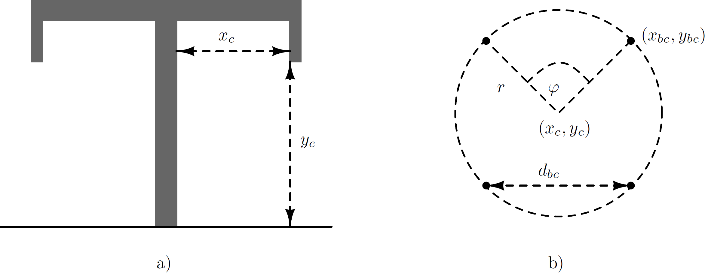
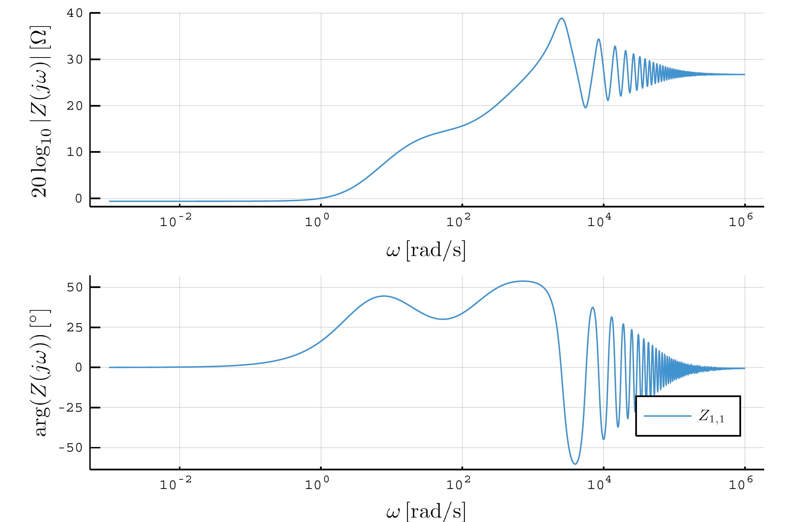

# Transmission line

The ABCD model parameters of a transmission line can be defined as [^1] [^2]
```math
\begin{bmatrix}
\mathbf{A} & \mathbf{B} \\
\mathbf{C} & \mathbf{D}
\end{bmatrix} =
\begin{bmatrix}
\cosh(\Gamma l) & \mathbf{Y}_c^{-1}\sinh(\Gamma l) \\
\mathbf{Y}_c \sinh(\Gamma l) &  \cosh(\Gamma l)
\end{bmatrix}
``` 
where$\mathrm{\Gamma} = \sqrt{\mathbf{Z}\mathbf{Y}}$ and
$\mathbf{Y}_c = \mathbf{Z}^{-1} \, \Gamma$, and $l$ standing for theline or cable length. The used formula is based on the frequency-dependent phase domain model.

## Overhead line

Based on realizations of the transmission line as defined in PSCAD, see Fig. [1] five possible realizations are defined as:

1.  flat (horizontal, which presents flat configuration without ground wires),

2.  vertical,

3.  delta (for at least three phases),

4.  offset (for at least three phases),

5.  concentric (for at least three phases).

Besides, the conductor positions can be added manually as absolute$(x,y)$ positions.

Thus, the simulator enables the creation of overhead lines with the **conductors** having the properties [^3] presented in the table [1].**Ground wires** have the properties presented in table[2].

*Table 1: OHL conductor parameters*
| **Symbol**               | **Meaning**                                                                 |
|---------------------------|-----------------------------------------------------------------------------|
| $n_b$                    | Number of bundles (or number of phases)                                    |
| $n_{sb}$                 | Number of subconductors per bundle                                         |
| $y_{bc}$                 | Height of the lowest bundle above ground                                  |
| $\Delta y_{bc}$          | Vertical offset between bundles                                           |
| $\Delta x_{bc}$          | Horizontal offset between the lowest bundles                              |
| $\Delta \tilde{x}_{bc}$  | Horizontal offset in the case of concentric and offset organization        |
| $d_{sb}$                 | Distance between closest subconductors with equidistant concentric organization (symmetric) |
| $d_{sag}$                | Maximal sag offset                                                        |
| $r_c$                    | Radius of the conductor                                                   |
| $R_{dc}$                 | DC resistance of the conductor                                            |
| $g_c$                    | Shunt conductance of the conductor                                        |
| $\mu_{r,c}$              | Relative permeability of the conductor                                    |
| Positions                | Added manually                                                            |
| Organization             | Can be flat, vertical, concentric, delta, or offset       

*Table 2: OHL groundwires' properties*
| **Symbol**      | **Meaning**                                                                      |
|------------------|----------------------------------------------------------------------------------|
| $n_g$           | Number of ground wires                                                          |
| $\Delta x_g$    | Relative horizontal distance between ground wires                                |
| $\Delta y_g$    | Relative vertical distance between ground wires and the lowest conductors        |
| $r_g$           | Radius of the ground wire                                                       |
| $d_{g,sag}$     | Ground wire sag                                                                 |
| $R_{g,dc}$      | DC resistance of the ground wires                                               |
| $\mu_{r,g}$     | Relative permeability of the ground wire                                        |


*Fig.1: PSCAD overhead line organization: 1) single conductor with groundwire;2) single conductor; 3) 2 conductors flat; 4) 3 conductors flat; 5) 3conductors delta; 6) 3 conductors horizontal; 7) 3 conductors vertical;8) 3 conductors concentric; 9) 3 conductors offset.*

The transmission line model is constructed using the procedure from [^3] [^4]. The overhead transmission line consists of $n_b$ including sub-conductors, stranding, etc. and$n_g$ ground wires.

Each line/conductor positioned as $x_c$ relatively starting from thecentral tower position and $y_c$ vertically, measured from ground, withthe sag at the midpoint between towers $d_{sag}$, see Fig.[2] modified vertical position is used in calculations as$\hat{y}_c = y_c - \frac{2}{3} \, d_{sag}$. Conductor is formed using $n_{sb}$ sub-conductors grouped in the bundle, where all sub-conductorsare grouped using symmetrical equidistant pattern with the distance between the two nearest sub-conductors being $d_{bc}$, or a bundlespacing. Using conductor position, the position of the eachsub-conductor can be estimated. Knowing the angle between two sub-conductors on the circle and its radius
```math
 \varphi = \frac{360^\circ}{n_{sb}}, \\
r = \frac{d_{sb}}{2 \sin(\varphi/2)}, 
```
 the position can be estimated starting from the angle $\varphi_s = \frac{\pi}{2}$ if the number of sub-conductors odd, orfrom $\varphi_s = \frac{\pi + \varphi}{2}$ for an even number of sub-conductors, as follows: 

```math
x_{bc} = x_c + r \cos(\varphi_s + k \, \varphi), \\ y_{bc} = y_c + r \sin(\varphi_s + k \, \varphi) - \frac{2}{3} \, d_{sag},  
```
 for $k \in \{1, 2, ..., n_{bc}\}$. If the number of sub-conductors is equal to one, its position is given by $(x_c, \hat{y}_c)$. Each conductor is characterized with the relative permeability of the material $\mu_r$, the conductor dc resistance $R_{dc}$ and the radius $r_i$.


*Fig.2: Overhead line modelling: a) tower and relative conductor positions; b)sub-conductor bundle.*

Ground wires are modeled similarly, represented with their relativeposition $(x_g,y_g)$, radius $r_g$, dc resistance $R_{gdc}$ and relativepermeability of the material $\mu_r$.

Earth parameters are given with permeability $\mu_e$, permittivity $\epsilon_e$ and conductivity $\rho_e$.

In order to represent the transmission line using ABCD parameters, it is necessary to calculate series impedance and shunt admittance matrices [^3]. Both matrices are of the size $n \times n$, where $n = \sum\limits_{i=1}^{n_c} n^i_{bc} + n_g$. The impedance matrix has the following form: 
```math
    \mathbf{Z} = \operatorname{diag}(Z_i) + 
    \begin{bmatrix}
    Z_{0,11} & \cdots & Z_{0,1n} \\
    \vdots & \ddots & \vdots \\
    Z_{0,n1} & \cdots & Z_{0,nn}
    \end{bmatrix}
```
where $Z_i = \frac{m\rho_i}{2\pi r_i} , \coth(0.733mr_i) + \frac{0.3179 \rho_i}{\pi r_i^2}, \quad \text{for the } i\text{-th conductor/sub-conductor/ground wire}.$

$r_i \text{ is its radius, resistivity } \rho_i = R^i_{dc} , \pi r_i^2, \quad m = \sqrt{j\omega ,\frac{\mu_0 \mu_{r,i}}{\rho_i}};$

The components $Z_{0,ij} = \frac{j\omega , \mu_0}{2\pi} , \log\left( \frac{\hat{D}{ij}}{d{ij}}\right).$ for:

$d_{ij} = \begin{cases} \sqrt{(x_i-x_j)^2 + (y_i-y_j)^2}, & \text{if } i \neq j, \ r_i, & \text{if } i = j, \end{cases}$

$D_{ij} = \begin{cases} \sqrt{(x_i-x_j)^2 + (y_i+y_j)^2}, & \text{if } i \neq j, \ 2y_i, & \text{if } i = j, \end{cases}$

$\hat{D}_{ij} = \sqrt{(y_i + y_j + 2d_e)^2 + (x_i-x_j)^2},$

$d_e = \sqrt{\frac{1}{j\omega \mu_e (\sigma_e + j\omega \epsilon_e)}}.$

The shunt admittance is a matrix formed as:
```math
\mathbf{Y} = s \, \mathbf{P}^{-1} + \mathbf{G}
```
from matrix $\mathbf{P}$ with its components $\mathbf{P}_{ij} = \frac{1}{2\pi\epsilon_0} \, \log\left( \frac{D_{ij}}{d_{ij}}\right)$ and $\mathbf{G} = \operatorname{diag}\{g_c\}$.

### Overhead line definition
```@meta
CurrentModule = PowerImpedanceACDC
```

Transmission line is defined with a struct and added as a field  `element_value` inside the `Element` struct. It consists of the following fields:
```@docs
PowerImpedanceACDC.overhead_line
```
### Example
OHL grounded with a resistance of 0.001 Ohm:

```math
\begin{aligned}
\text{overheadline} = (&\text{length} = 90 \times 10^3, \, 
\text{conductors} = \text{Conductors}(\text{organization} = \text{:flat}, \, 
n^b = 3, \, n^{sb} = 1, \, R^{dc} = 0.063, \, r^c = 0.015, \, y^{bc} = 30, \, \\
&\delta y^{bc} = 0, \, \delta x^{bc} = 10, \, \delta \tilde{x}^{bc} = 0, \, d^{sb} = 0, \, d^{sag} = 10), \, \\
&\text{groundwires} = \text{Groundwires}(n^g = 2, \, R^{gdc} = 0.92, \, r^g = 0.0062, \, \delta x^g = 6.5, \, \delta y^g = 7.5, \, d^{gsag} = 10), \, \\
&\text{earth parameters} = (1, 1, 100), \, \text{transformation} = \text{true}).
\end{aligned}
```
A Bode plot is provided in Fig. 3, showing the short-circuit impedance matrix for the two-OHTL system defined in the previous example.


*Fig.3 Overhead line at the DC side example*
```math
%{#fig:validation_OHL_error}
```
## Cable
The cable groups are implemented focusing on the availableconfigurations of the cables available in PSCAD, where a cable can be included either placed inside the pipe, so called pipe-type cables, orplaced underground. Cables are usually coaxial with up to 4 layers ofboth conductors and insulators.

Cables can be insulated or pipe-type coaxial cables. At the moment, onlya group of coaxial cables is implemented in the package. A cable group consists of $n$ cables, each one have maximum three conducting layers and three insulation layers, as can be seen from Fig. [4]. The conducting layers of the cable are denoted as core, sheath and armor. Between the conducting layers, there are insulators, except for the last conductor where the insulator is not a strict necessity, but it is common. For each conductor the following set of parameters is given: $r^c_i$ and $r^c_o$ as conductor inner and outer radius in meters, conductor relative permeability $\mu^c_r$ and conductor resistivity $\rho_c$ (in [$\Omega$.m]). The insulator is described using the following parameters: $r^i_i$ and $r^i_o$ are the insulator inner and outer radius in meters, $\epsilon^i$ is the insulator relative permittivity and $\mu^i_r$ the insulator relative permeability.


*Fig.4: Coaxial cable*

Additionally, the configuration parameters can be modified by adding two semiconducting layers in the insulator 1, and implementing the sheathbconsisting of the wire screen and outer sheath layer. In that case, the
procedure described in [^5] is applied.

-   Conductor surface impedance

    A hollow conductor surface impedance is given by: 
 ```math
\begin{aligned}
Z_{aa} &= \frac{\rho_c m}{2\pi r^c_i} \, \coth(m(r^c_o - r^c_i)) + \frac{\rho^c}{2\pi r^c_i \, (r^c_i + r^c_o)} \; \left[\frac{\Omega}{\text{m}}\right]  & \text{(for inner surface)}, \\
Z_{bb} &= \frac{\rho^c m}{2\pi r^c_o} \, \coth(m(r^c_o - r^c_i)) + \frac{\rho^c}{2\pi r^c_o \, (r^c_i + r^c_o)} \; \left[\frac{\Omega}{\text{m}}\right]  & \text{(for outer surface)}, \\
Z_{ab} &=  \frac{\rho^c m}{\pi (r^c_i + r^c_o)} \, \operatorname{csch}(m(r^c_o - r^c_i)) \; \left[\frac{\Omega}{\text{m}}\right].
\end{aligned}
``` 
 where $m = \sqrt{j\omega\mu^c_r}$ For a non-hollow conductor, the outer surface impedance is 
 ```math
    Z_{bb} = \frac{\rho^c m}{2\pi r^c_o} \, \coth(0.733 m r^c_o) + \frac{0.3179 \rho^c}{\pi {r^c_o}^2} \; \left[\frac{\Omega}{\text{m}}\right].
 ```

-   The insulator layer between two conductors has an impedance
    ```math
    Z_i = \frac{j\omega \mu_0 \mu^i_r}{2\pi} \, \log\left(\frac{r^i_o}{r^i_i}\right).
    ```

-   The earth return impedance of the cable and mutual between cables is
     ```math
    Z_g = \frac{j\omega \, \mu_g}{2\pi} \, \left(-\log\left(\frac{\gamma m D}{2}\right) + \frac{1}{2} - \frac{2}{3} \, mH\right).
    ```
    for 
    ```math
    \begin{aligned}
    D =& \left\{ 
    \begin{array}{ll}
    \sqrt{(x_i - x_j)^2 + (y_i - y_j)^2} & \quad \text{for cables } i \neq j, \\
    r_i & \quad \text{radius of the cable }i,
    \end{array} 
    \right. \\
    H = &\left\{ 
    \begin{array}{ll}
    y_i + y_j & \quad \text{for cables } i \neq j, \\
    2y_i & \quad \text{for the cable }i,
    \end{array} 
    \right. \\
        \end{aligned}
    ```
     and $\gamma \approx 0.5772156649$ being Euler's constant.

According to [^6] [^7], one cable is represented with its series impedance $\mathbf{Z}_{ii}$ matrix. Each matrix $\mathbf{Z}_{ii}$ has the size $n_c \times n_c$ and its entries for $j \in \{1, \ldots, n_c-1\}$ are given by
 ```math
\begin{aligned}
\mathbf{Z}_{ii} \langle j,j \rangle &= Z^j_{bb} + Z^j_i + Z^{j+1}_{aa}, \\
\mathbf{Z}_{ii} \langle j,j+1 \rangle &= Z_{ii} \langle j+1,j \rangle = - Z^{j+1}_{ab}, \\
\mathbf{Z}_{ii} \langle n_c, n_c \rangle &= Z^{n_c}_{bb} + Z^{n_c}_i + Z^{ii}_g,
\end{aligned}
```
and otherwise the matrix entries are 0.

Mutual surface impedances between the cables are given by matrix $\mathbf{Z}_{ij}$ having all components equal to $Z^{ij}_g$.

The shunt admittance matrix can be estimated as $\mathbf{Y} = s\mathbf{P}^{-1}$ and matrix $P$, which has the form
```math
\mathbf{P} = \begin{bmatrix} \mathbf{P}_{11} & \mathbf{P}_{12} & \cdots & \mathbf{P}_{1n} \\ \vdots & \ddots & & \vdots \\     \mathbf{P}_{n1} & \mathbf{P}_{n2} & \cdots & \mathbf{P}_{nn}
\end{bmatrix}.
```
Matrices $\mathbf{P}_{ii}$ have components
```math
\mathbf{P}_{ii} = \begin{bmatrix}
P_c + P_s + P_a & P_s + P_a & P_a \\
P_s + P_a & P_s + P_a & P_a \\
P_a & P_a & P_a
\end{bmatrix} + 
\begin{bmatrix}
P_{ii} & P_{ii} & P_{ii} \\
P_{ii} & P_{ii} & P_{ii} \\
P_{ii} & P_{ii} & P_{ii} 
\end{bmatrix},
``` 
where $P_{c,s,a}$ belong respectively to core, shield and armor insulators and have the following values:
$P = \frac{\log(r_o/r_i)}{2\pi\epsilon}$ and
$P_{ii} = \frac{\log(2h_i/r)}{2\pi\epsilon_0}$ is a earth return.
Matrices $\mathbf{P}_{ij}$, for $i \neq j$,have all components equal to
$P_{ij} = \frac{\log(D_2/D_1)}{2\pi\epsilon_0}$, where
$D_1 = \sqrt{(x_i-x_j)^2 + (y_i-y_j)^2}$ and
$D_2 = \sqrt{(x_i-x_j)^2 + (y_i+y_j)^2}$ [^6].

As it is valid to assume that sheath and armor are grounded, it is allowed to use Kron reduction. Using Kron reduction, as proposed in [^8] [^9], when applied to the matrices $Y$ and $Z$ a compact shunt admittance and series impedance model is obtained. For determining the corresponding ABCD parameters, the same procedure is used as for the transmission line.

### Cable definition

Cable is defined with a struct and added as a field  `element_value` inside the `Element` struct. It consists of the following fields:
```@docs
PowerImpedanceACDC.cable
```
### Example

```math 

cable(length = 60e3, positions = [(0,1.9), (0.5,1.9), (1,1.9)], \\
C1 = Conductor(r_o = 31.75e-3, \rho = 2.18e-8, \mu_r = 1), \\
I1 = Insulator(r_i = 31.75e-3, a = 0.002, b = 0.0013, r_o = 60.85e-3, \epsilon_r = 2.26),\\
C2 = Conductor(r_i = 60.85e-3, r_o = 61.05e-3, \rho = 1.72e-8, \mu_r = 1),\\
I2 = Insulator(r_i = 61.05e-3, r_o = 65.95e-3, \epsilon_r = 2.26),\\
earth\_parameters = (1,1,25), transformation = true)

```
A Bode plot is provided in Fig. [5] for the short-connected cable defined in the previous example with a length of 100 km.

*Fig.5: Cable example for line length 100 km.*
```math
%{#fig:validation_cable}
```
## Mixed OHL-cable
Mixed OHL-cable components contain OHLs and cable sections.. Each OHLnand cable section is characterized individually and a complete 'mixed OHL-cable' component is presented with the equivalent ABCD
representation.

This ABCD representation has the form:
```math
ABCD = \prod\limits_{\eta=1}^n ABCD_\eta
```
where $ABCD_\eta$ are the ABCD parameters of an OHL or cable section, while $n$ is the total number of sections.
## References
[^1]: F. Castellanos and J. R. Marti, "Full frequency-dependent phase-domain transmission line model," IEEE Transactions on Power Systems, vol. 12, no. 3, pp. 1331-1339, 1997.
[^2]: A. Morched, B. Gustavsen, and M. Tartibi, "A universal model for accurate calculation of electromagnetic transients on overhead lines and underground cables," IEEE Transactions on Power Delivery, vol. 14, no. 3, pp. 1032-1038, 1999.
[^3]: J. A. Martinez-Velasco, Power System Transients: Parameter Determination, Boca Raton, FL, USA: CRC Press, 2017.
[^4]: M. HVDC, "Research Centre Inc," PSCAD/EMTDC user's guide, 2003.
[^5]: L. Wu et al., "Impact of EHV/HV underground power cables on resonant grid behavior," Eindhoven University of Technology, Eindhoven, Netherlands, 2014.
[^6]: A. Ametani, "A general formulation of impedance and admittance of cables," IEEE Transactions on Power Apparatus and Systems, no. 3, pp. 902-910, 1980.
[^7]: P. de Arizon and H. W. Dommel, "Computation of cable impedances based on subdivision of conductors," IEEE Transactions on Power Delivery, vol. 2, no. 1, pp. 21-27, 1987.
[^8]: F. de Léon, M. L. Márquez-Asensio, and G. Álvarez-Cordero, "Effects of conductor counter-transposition on the positive-sequence impedance and losses of cross-bonded cables," IEEE Transactions on Power Delivery, vol. 26, no. 3, pp. 2060-2063, 2011.
[^9]:R. A. Rivas and J. R. Marti, "Calculation of frequency-dependent parameters of power cables: Matrix partitioning techniques," IEEE Transactions on Power Delivery, vol. 17, no. 4, pp. 1085-1092, 2002.

